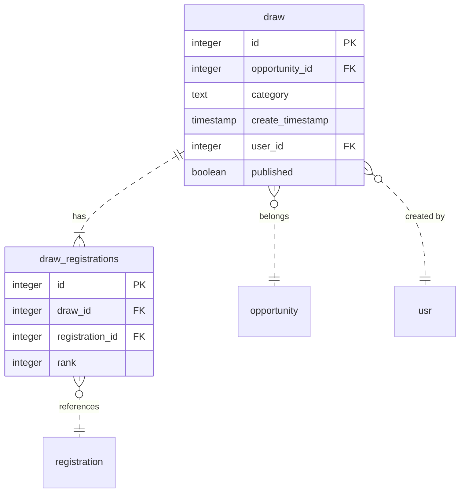
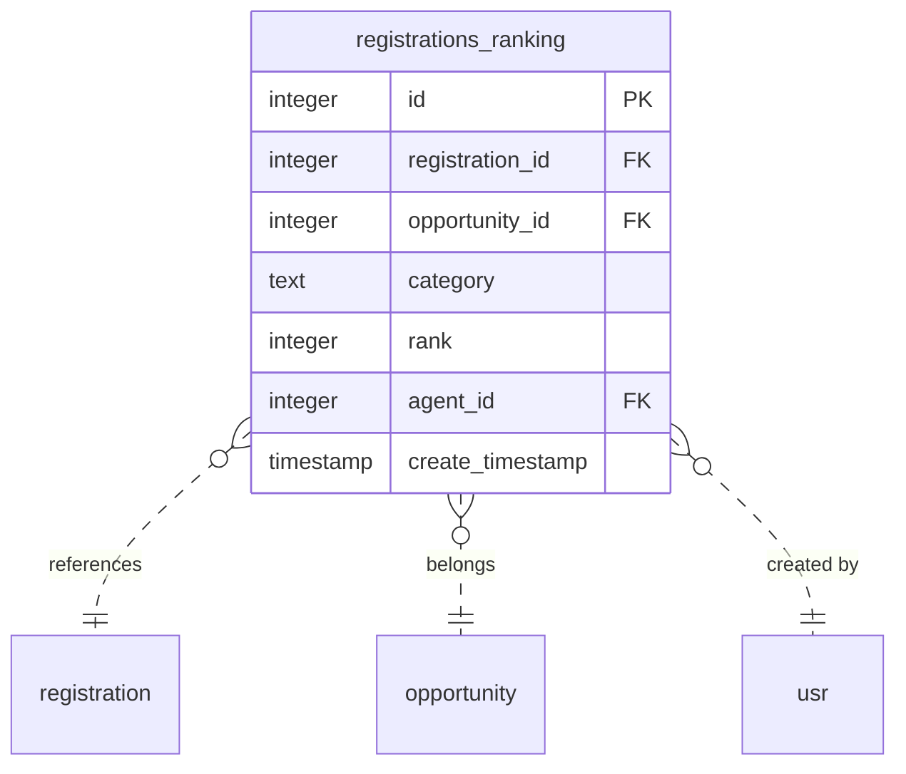

# Módulo RegistrationsDraw
Esse módulo adiciona a possibilidade de configurar uma oportunidade documental ou simplificada para ordenar aleatoriamente as inscrições em formato de ranking, via seleção aleatória (sorteio).

### Diagrama De Banco de Dados

